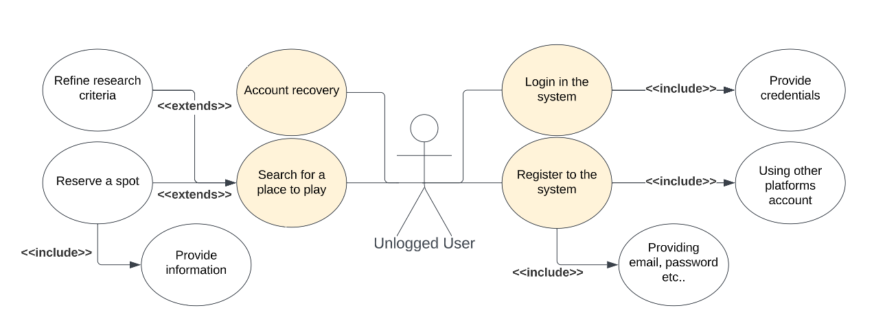

# User story and use case description

## Application description and main goals

The idea around the application is to help musician in their daily life, providing them with a tool that can help them to find other musicians to play with, places where they can play their instruments and a way to track their progress in a way to improve themselves.

The main goal of the applicatione is to offer a way for the user to meet new musicians to jam with. The musicians suggested by the system will be based on the user's profile and the musical context of the user deducted in real-time.

Secondarly, the application will be capable of keeping track of the user's progress and help him play along with a backing tracks, based on the user preferences and the real-time deducted musical context.

---

## User Stories

The following user stories are the one that the use cases are built around.

1. As a musician, who just moved in town, i want to play my smart guitar with someone, so that i can have fun and meet new people.

2. As a beginner guitarist, who can't play at home because of the neighbors, i want to find a place where i can play my guitar, so that i can do my exercise and improve myself.

3. As a musician, who wants to train with his instruments, i want something that helps me track my progress and is capable of providing me with a backing track, so that i can improve myself.

---

## Actors

The system will be accessible for different kind of actors

- Unlogged users
- Logged users
- Moderators users (Administrators of the system)
- Smart instruments (?)

---

### Logged Users Use Cases

Possible use cases for the users that are logged in the system.
The main idea is that the application will help the user to find other musicians or places where he can play  

---

||
|:--:|
|*Complete schema of the logged user use cases*|
---

### Use Case "Play with someone"

**Abstract**:
It lets the user to discover and meet someone to play with.

**Description**:

1. Based on the user profile and the actual context the system will provide
other profiles whose match the user's one.[Exception 1]
2. The user can contact other musicians.
    2.1 The user can send a message to the other musician.
    2.2 The user can add as a friend the other musician.
3. The user can also refine some research criteria. [Exception 2]

**Exceptions**:

- Exception 1: It may be possible for the user to not find other musicians to play with. The system will report such error
- Exception 2: The criteria provided are incompatible.

---

#### Use Case "Play Alone"

**Abstract**:
The user can play along with the system.

**Description**:

1. The system will detect the actual musical context. [Exception 1]
2. The user can press a button to start the backing track provided by the system. [Exception 2]
3. The user can manually set the jam session parameters.

**Exception**:

- Exception 1: The smart instrument can't detect or update the musical context of the user, or it may be wrong
- Exception 2: The system can't provide a backing track for the actual musical context.

---

#### Use Case "Update musician context"

**Abstract**:
The user can set or update his actual musical context.

**Description**:

1. The user lets the system to detect the actual musical context. [Exception 1]
2. The user can provide the context manually, adding more details.

**Exception**:

- Exception 1: The smart instrument can't detect or update the musical context of the user, or it may be wrong

---

#### Use Case "Search for a place to play"

**Abstract**:
The user can search available places where is possible to play with instruments, either for training or for playing in public.

**Description**:

1. The system will provide the user with a list of places where the user can go play his instrument and meet other musicians.
    1.1 The user can provide some other criteria to refine the search. [Exception 1]
2. The user clicks on that place and the system will provide the user with the details of that place.
   2.1 The user can add that place to his favorites.
3. The user can book a reservation for that place. [Exception 2]

**Exceptions**:

- Exception 1: There are no places near the user where he can play.
- Exception 2: There are no available spaces to reserve.

---

#### Use Case "Make yourself available"

**Abstract**:
The user can make himself available to play with other musicians.

**Description**:

1. Using the profile page, the user can set his availability to play with other musicians.
    1.1 The user can add some details about his availability (e.g. where he is, when he will be available etc.).

---

#### Use Case "Add a place"

**Description**:

1. The user can open the page to add a place.
2. The user can fill the form to add a place.
    2.1 The user adds the information about the place's availability.
    2.2 The user adds the information about the place's location.
3. The user can add an event that will be held in that place.
    3.1 The user can add the information about the event. [Exception 3]
4. The user can publish the place. [Exception 1-2]

**Exceptions**:

- Exception 1: The place is already present in the system.
- Exception 2: The place has some missing or wrong information.
- Exception 3: The event has some missing or wrong information.

---

#### Use case "Discover something new to play"

**Abstract**:
The user can discover new music to play based on his musical context and what is played around him.

**Description**:

1. The system will provide the user with a list of genre that match the user's musical context based on what is played by the musicians near him.
    1.1 The user can provide some other criteria to refine the search. [Exception 1]
2. The user can click on a genre and the system will provide the user with the details of that genre.
    2.1 The user can add that genre to his favorites.
3. The user can play that genre with the system. [Exception 2]

**Exceptions**:

- Exception 1: There are no genres that match the user's musical context.
- Exception 2: The system can't provide a backing track for that genre.

---

#### Use case "Start training session"

**Abstract**:
The user can start a training session with the system and keep track of his progress.

**Description**:

1. The user can open the page to start a training session and play along with the system. [Exception 1]
2. The user can write what is training on.
3. The user can set a daily reminder for the training session.

**Exceptions**:

- Exception 1: The system can't provide a backing track for the user.

---

### Discarded Use Cases

- Create an event: The user can create an event and invite other musicians to join him.

<!-- **Abstract**:
The user can create an event. -->

<!-- **Description**:

1. The user can open the page to create an event.
2. The user fills the form to create an event.
    2.1 The user can add the information about the event. [Exception 1]
3. The user can publish the event. [Exception 2]

**Exceptions**:

- Exception 1: The event has some missing or wrong information.
- Exception 2: The event is already present in the system. -->

- Check for event nearby: The user can check if there are events around him where he can play.

<!-- **Abstract**:
The user can check if there are events around him where he can play. -->

<!-- **Description**:

1. The system will provide the user with a list of events corresponding to the user's interest. [Exception 1] [Exception 2]
2. The user can click on an event and the system will provide the user with the details of that event.
    2.1 The user can book himself at the event. [Exception 3]
        2.1.1 The user can choose to participate as a musician or as a spectator.
    2.2 The user can send that event to his friends.

**Exceptions**:

- Exception 1: There are no events near the user.
- Exception 2: The events are not matching the user's interest.
- Eccezione 3: The event is already full. -->

---

### Unlogged user

Possible use cases for an unlogged user. The user that is not logged in the system should be able only to search for places where he can play or enter the system by registering or logging in.

||
|:--:|
|*Complete schema of the unlogged user use cases*|

---

#### Use Case "Search for a place to play"

Same as the logged user [use case](#use-case-search-for-a-place-to-play).

---

#### Use Case "Register to the system"

**Abstract**:
The user can register and create a new account in the system.

**Description**:

1. The user can open the page to register. [Exception 1]
2. The user provide the necessary information to register. [Exception 2 - 3]
    2.1 The user can register using third party services (e.g. Facebook, Google, etc.).

**Exceptions**:

- Exception 1: The account is already present in the system.
- Exception 2: The user has provided some wrong or missing information.
- Exception 3: The user has provided some information already used for other accounts.

---

#### Use Case "Login to the system"

**Abstract**:
The user can login to the system.

**Description**:

1. The user can open the page to login.
2. The user provide the necessary information to login. [Exception 1 - 2]
3. The user enters the system.

**Exceptions**:

- Exception 1: The user has provided some wrong or missing information.
- Exception 2: The user is not registered in the system.

---

#### Use Case "Account Recovery"

**Abstract**:

The user can recover his account in case he has lost his credentials.

**Description**:

1. The user can open the page to recover his account.
2. The user provide the necessary information to recover his account. [Exception 1 - 2]

**Exceptions**:

- Exception 1: The user has provided some wrong or missing information.
- Exception 2: The user is not registered in the system.

---

## Comments/Todo

- Gli attori sono ancora da definire.
- Mancano i casi d'uso "standard" per gestione profilo, login, registrazione, ecc.
- Non sono sicuro se gli smart instrument siano da inserire come attori. Non se se considerarli un tutt'uno col sistema o un attore a parte.
- Si potrebbe aggiungere un sistema per lasciare delle recensioni per i luoghi dove suonare.
