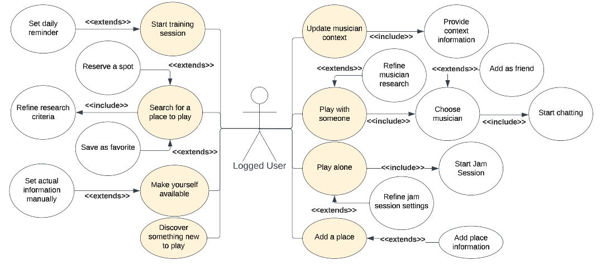

# Use Case Description

## General Requirements

### Users

The system will be accessible for different kind of users:
    - Unlogged users
    - logged users

---

### Logged Users Use Cases

Possible use cases for the users that are logged in the system

---

### Use Case "Play with someone"

**Abstract**:
It lets the user to discover and meet someone to play with.

**Description**:

1. Based on the user profile and the actual context the system will provide
other profiles whose match the user's one.[Exception 1]
2. The user can contact other musicians.
3. The user can also refine some research criteria.

**Exceptions**:

- Exception 1:
It may be possible for the user to not find other musicians to play with.
The system will report such error
- Exception 2:
The criteria provided are incompatible.

---

#### Use Case "Play Alone"

**Abstract**:
The user can play along with the system.

**Description**:

1. The system will detect the actual musical context using his smart instrument or manually. [Exception 1]
2. The user can play along with the system.

**Exception**:

- Exception 1:
The smart instrument can't detect or update the musical context of the user, or it may be wrong

---

#### Use Case "Change Profile"

**Abstract**:
The user can change his profile.

**Description**:
The user can change his profile, adding or removing some information like the
musical instruments he plays, the musical genres he likes, personal data and so on.

---

#### Use Case "Update context"

**Abstract**:
The user can set or update his actual musical context.

**Description**:

1. The user lets the system to detect the actual musical context. [Exception 1]
2. The user can provide the context manually, adding more details.

**Exception**:

- Exception 1:
The smart instrument can't detect or update the musical context of the user, or it may be wrong

---
